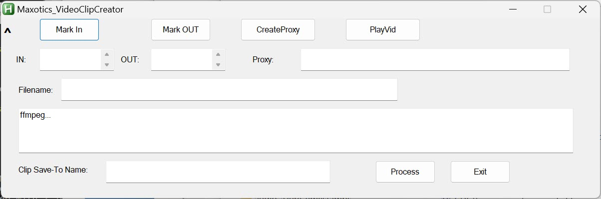
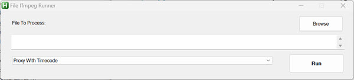
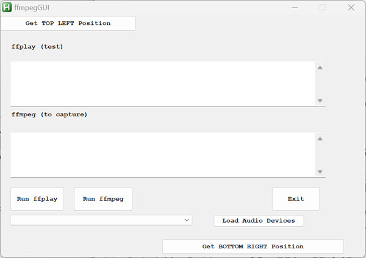

# Headless Filmmaking
**Tools** to work with video/audio using headless tools like ffmpeg.  These all work, but far from robust.  

Most ffmpeg snippets in \cookbooks

***IN DEVELOPMENT!*** Using ffmpeg builds from [Gyan.dev](https://www.gyan.dev/ffmpeg/builds/) (I want latest HVENC (GPU) libraries)

You need [AutoHotKey](https://www.autohotkey.com/)  installed for these scripts to work.

INSTRUCTIONS.  First, you must have ffmpeg installed on your Windows PC and it must be findable through the Windows environment path  (or you'll have to hard code where you have it in the code).  Next, put all these files in a folder.  For the Webcam capture, you'll want to press the button "Load Available Capture Devices".  From the list, pick the webcam and microphone devices you want to use.  Then press "Save My Capture Devices".  They should load every time you launch the GUI (unless you change them)

**Quick video trim tool for videos** (updated 2/27/2024)

I don't know why I can't find a solution that works the way I want it to.  Any ideas?  Anyway, this does exactly what I want.  

1. Ability to select a section of a video and save it to another video with the name I give to it (the clip)

2. Ability to quickly scrub back and forth in the video.  I accomplish this by having it create a proxy first.  the proxy plays in the MPV player, but when it creates the clip, uses the original video file.
3. Ability to change ffmpeg  parameters to anything I want.  AHK scripts are text files, so easy-peasy.

NOTE: You need a Lua script "copyTime.lua" for it to get the in and out points through the clipboard.

o. Fast conversion of media files

o. Capture a portion of the screen and use some tricks to make it a transparent webm video that can be used as graphics later on.

o. Webcam capture using some cool techniques from FFMPEG GUY.

Big thanks for inspiration from [FFMPEG GUY](https://www.youtube.com/@theFFMPEGguy). @maclev on the AHK forum solved a very difficult problem I came up against in the ffmpeg webcam capture script.
