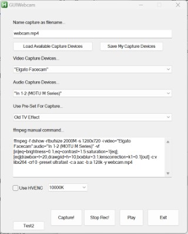

<<<<<<< HEAD
# Headless Filmmaking
**Tools** to work with video/audio using headless tools like ffmpeg

IN DEVELOPMENT!

o. Fast conversion of media files

o. Capture a portion of the screen and use some tricks to make it a transparent webm video that can be used as graphics later on.

o. Quick trim tool for videos

o. Webcam capture using some cool techniques from FFMPEG GUY.

